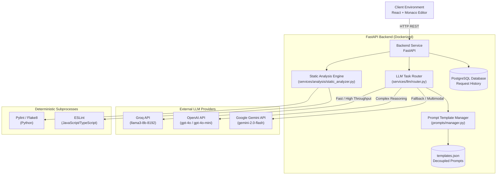
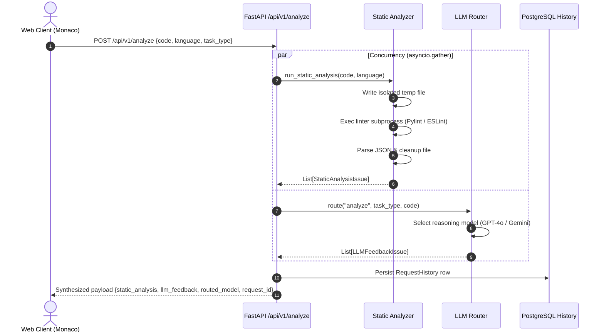

# AI Code Generation and Analysis Platform — System Architecture

This document details the architectural design, Model Routing strategy, prompt engineering methodology, and static analysis integration of the **AI Code Generation and Analysis Platform**.

---

## 1. High-Level System Architecture

The platform is designed around a decoupled, microservice-ready architecture that balances latency, inference cost, and analytical rigor.



---

## 2. Model Routing Strategy

### 2.1 The Problem It Solves
State-of-the-art frontier models (e.g., GPT-4o, Claude 3.5 Sonnet) excel at high-level reasoning and architectural diagnosis, but are costly and exhibit higher latency. In contrast, smaller open-weights models served via low-latency inference engines (e.g., Llama 3 8B via Groq) execute in milliseconds at a fraction of the cost, making them ideal for boilerplate generation, docstrings, formatting, and translations.

The platform employs a **Programmatic Multi-Model Router** (`TaskRouter`) to dynamically dispatch requests according to task complexity, input volume, and provider availability.

### 2.2 Routing Decision Matrix

| Task Type | Target Model Tier | Default Model | Justification |
| :--- | :--- | :--- | :--- |
| `boilerplate` | Fast Tier | `groq/llama3-8b-8192` | Low complexity, rapid scaffolding, high-speed generation |
| `unit_test` | Fast Tier / Mid | `groq/llama3-8b-8192` | Standard testing patterns, predictable input/output contracts |
| `docstring` | Fast Tier | `groq/llama3-8b-8192` | Syntactic summarization, standard docstring conventions |
| `format` | Fast Tier | `groq/llama3-8b-8192` | Structural alignment, deterministic code reformatting |
| `completion` | Fast Tier | `groq/llama3-8b-8192` | Real-time code continuation, low latency requirement |
| `translate` | Fast Tier | `groq/llama3-8b-8192` | Cross-language translation with standard syntax |
| `code_review` | Reasoning Tier | `openai/gpt-4o-mini` | Context-aware issue detection, style, readability |
| `bug_hunt` | Reasoning Tier | `openai/gpt-4o-mini` | Complex control-flow analysis, race conditions, edge cases |
| `security_audit`| Reasoning Tier | `openai/gpt-4o-mini` | Vulnerability assessment (OWASP, injection, memory leaks) |
| `refactor` | Reasoning Tier | `openai/gpt-4o-mini` | Architectural restructuring, design pattern optimization |

### 2.3 Router Heuristics & Fallback Logic
1. **Endpoint Inspection**:
   - `/api/v1/generate`: Evaluates `task_type` and prompt length. Long prompts (>1,500 characters) or tasks marked `refactor` escalate to the reasoning model.
   - `/api/v1/analyze`: By default requires deep semantic review and routes to the reasoning model (`gpt-4o-mini` or `gemini-2.0-flash`).
2. **Provider Failover & Resilience**:
   - Each provider client implements exponential backoff retry (up to 3 retries) on HTTP 429 (Rate Limit) and HTTP 5xx errors.
   - If the primary provider fails (e.g., Groq outage), the router transparently falls back to an alternative provider (e.g., OpenAI or Gemini) without throwing a fatal application error.
   - If all configured upstream providers fail or time out, the backend intercepts the failure and returns a structured `HTTP 503 Service Unavailable` with descriptive diagnostics.

---

## 3. Prompt Engineering Approach

### 3.1 Strict Decoupling
Prompts are isolated from API routing logic using a dedicated `PromptTemplateManager` backed by `templates.json`. This separation permits prompt iteration, versioning, and A/B evaluation without modifying application code.

### 3.2 Anti-Conversational & Code-Only Generation Prompts
LLMs frequently add conversational filler ("*Here is the code...*", "*I hope this helps!*"). To eliminate this, the system prompt strictly enforces:
- Output **must** be pure code only.
- No introductory or concluding remarks.
- Markdown code fences are stripped programmatically in both pre- and post-processing pipelines using `strip_markdown_code_fences()`.

```python
# System prompt contract for code generation
SYSTEM_PROMPT = """You are an elite, production-grade code generation engine.
You write clean, idiomatic, type-annotated, and performant code.
CRITICAL RULES:
1. Output ONLY the raw executable source code.
2. Do NOT output conversational filler, markdown formatting, or preamble.
3. If explanation is requested, supply it in a dedicated separated section or parameter."""
```

### 3.3 Structured JSON Schema for Code Review
For code analysis, LLMs must return parseable JSON matching the `LLMFeedbackIssue` schema:
```json
[
  {
    "issue_type": "Security | Bug | Performance | Code Quality",
    "description": "Concise explanation of the defect",
    "suggested_fix": "Concrete remediation snippet or guidance",
    "severity": "high | medium | low"
  }
]
```
The backend parser extracts JSON payloads from responses even if surrounded by whitespace or escaped fences, and normalizes unexpected structures into valid arrays.

---

## 4. Static Analysis Integration & Synthesis Pipeline

### 4.1 Subprocess Execution Pipeline
While LLMs provide semantic insights, they are probabilistic and prone to hallucinations. Traditional static analysis tools provide deterministic guarantees regarding syntax errors, undefined variables, and styling violations.

The static analysis pipeline works as follows:
1. **Isolated Workspace**: Code is written to a unique, transient file using Python's `tempfile.NamedTemporaryFile` with restricted file permissions (`0o600`).
2. **Subprocess Sandboxing**:
   - Analysis tools are invoked using `asyncio.create_subprocess_exec` (or `subprocess.run`).
   - Resource execution limits: strict timeouts (5–10s) prevent infinite loops or hanging processes.
   - Clean environment variables without leaking credentials.
3. **Multi-Linter Dispatch**:
   - **Python**: Runs `pylint --output-format=json` (with fallback to `flake8`).
   - **JavaScript / TypeScript**: Runs `eslint --format json`.
4. **Deterministic Output Parsing**:
   - Linter outputs are parsed into a normalized schema:
     ```python
     {
         "line_number": int,
         "column": int,
         "type": "error" | "warning" | "convention" | "refactor",
         "message": str,
         "rule": str
     }
     ```
5. **Immediate Cleanup**: Temporary files are deleted in a guaranteed `finally` block.



### 4.2 Asynchronous Synthesis
In the `/api/v1/analyze` endpoint, static analysis and LLM evaluation execute concurrently using `asyncio.gather()`:
```python
static_task = run_static_analysis(request.code, request.language)
llm_task = task_router.route(
    endpoint="analyze",
    task_type=request.task_type,
    prompt=request.code,
    language=request.language
)

static_results, llm_result = await asyncio.gather(
    static_task,
    llm_task,
    return_exceptions=False
)
```
This concurrency minimizes overall response time to the maximum of `(time(static_analysis), time(llm_inference))` rather than their sum.

---

## 5. Persistence and History Model

All requests and synthesized responses are persisted to PostgreSQL via SQLAlchemy async ORM.

### Schema (`request_history` table)
- `id` (VARCHAR(36), PK): UUID identifier
- `endpoint_used` (VARCHAR(50)): `'generate'` or `'analyze'`
- `language` (VARCHAR(50)): Source language (python, javascript, etc.)
- `task_type` (VARCHAR(100)): Task subtype
- `user_input` (TEXT): Natural language prompt or submitted code
- `model_routed_to` (VARCHAR(200)): Model identifier that handled the task
- `response_payload` (JSONB / JSON): Complete client response payload
- `created_at` (TIMESTAMP WITH TIME ZONE): UTC creation timestamp

This persistence layer allows developers to audit previous operations, track model quality, and measure routing effectiveness over time.
