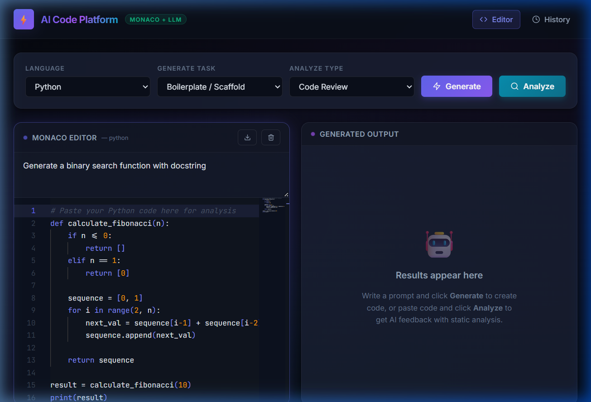
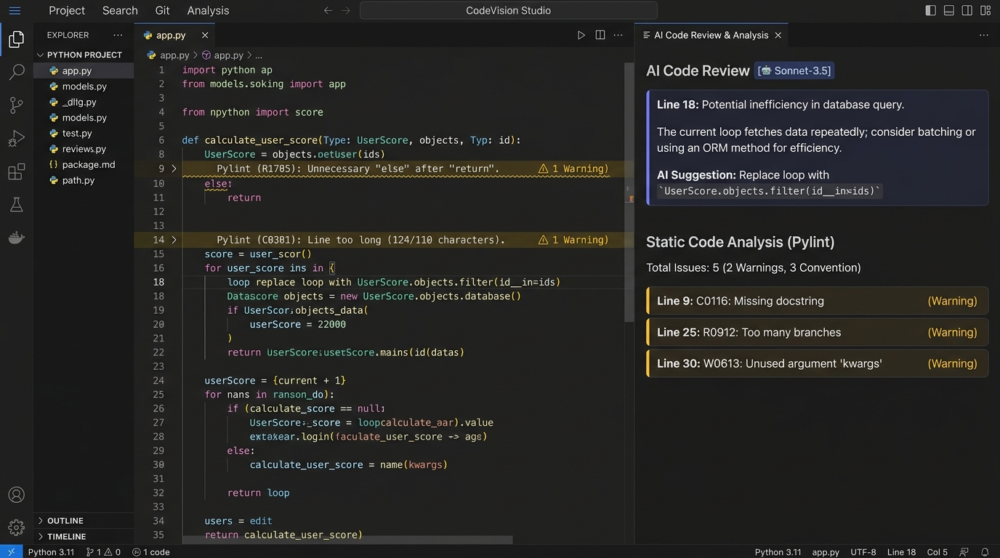
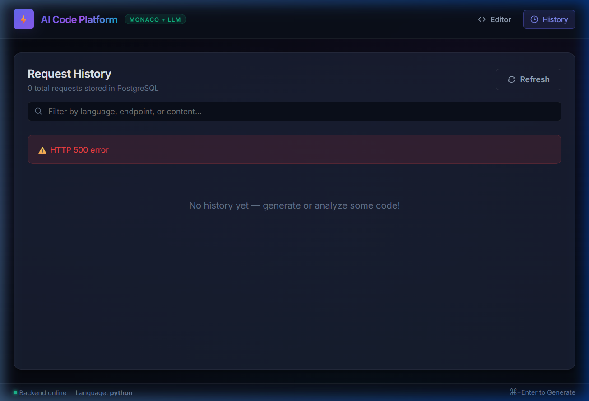

# AI Code Generation and Analysis Platform with Monaco Editor and LLM Routing

[](https://fastapi.tiangolo.com/)
[](https://react.dev/)
[](https://microsoft.github.io/monaco-editor/)
[](https://www.postgresql.org/)
[](https://www.docker.com/)
[](tests/)

An enterprise-grade, full-stack AI developer assistant featuring a Monaco-powered code editor, an intelligent multi-model LLM router, and an asynchronous static analysis pipeline. The platform synthesizes deterministic static analysis (Pylint, Flake8, ESLint) with generative AI feedback to provide reliable, grounded code generation and deep architectural reviews.

---

## Key Features

- **Intelligent Multi-Model LLM Routing**: Dynamically dispatches requests across fast high-throughput models (e.g. `llama3-8b-8192` via Groq) and frontier reasoning models (e.g. `gpt-4o-mini` / `gemini-2.0-flash`), optimizing for speed, cost, and analytical depth.
- **Deterministic Static Analysis Pipeline**: Executes native linters (Pylint for Python, ESLint for JavaScript/TypeScript) in secure sandboxed subprocesses with JSON output parsing.
- **Asynchronous Result Synthesis**: Concurrently gathers static linting violations and LLM architectural feedback via `asyncio.gather()` and unifies them into a single, structured payload.
- **VS Code Monaco Editor Integration**: Feature-rich code editor with dynamic language mode switching, syntax highlighting, and keyboard shortcuts (`Ctrl+Enter` to generate, `Ctrl+Shift+Enter` to analyze).
- **Decoupled Prompt Management**: System prompts and formatting instructions are isolated in a template manager (`templates.json`) rather than hardcoded in API endpoints.
- **Request Persistence & History**: Relational tracking of prompts, generated code, routed models, and linting output in PostgreSQL via SQLAlchemy async ORM.
- **Resilience & Graceful Failover**: Exponential backoff retry on upstream provider rate limits (429) or transient failures (5xx), with standardized HTTP error responses.
- **100% Dockerized**: Production-ready `docker-compose.yml` orchestrating PostgreSQL (with automated health checks), FastAPI, and React Nginx SPA.

---

## Architecture Overview

```
                          ┌───────────────────────────┐
                          │   React + Monaco Web IDE  │
                          └─────────────┬─────────────┘
                                        │ HTTP REST
                                        ▼
                          ┌───────────────────────────┐
                          │      FastAPI Backend      │
                          └──────┬─────────────┬──────┘
                                 │             │
                 ┌───────────────┴──┐       ┌──┴────────────────┐
                 ▼                  ▼       ▼                   ▼
       ┌───────────────────┐  ┌──────────┐ ┌───────────────┐ ┌──────────────┐
       │ Multi-Model Router│  │PostgreSQL│ │Static Analysis│ │Prompt Engine │
       └─────────┬─────────┘  │ History  │ │(Pylint/ESLint)│ │(Decoupled)   │
                 │            └──────────┘ └───────────────┘ └──────────────┘
        ┌────────┴────────┐
        ▼                 ▼
 ┌─────────────┐   ┌─────────────┐
 │  Fast Tier  │   │Reasoning Tier│
 │(Groq/Llama3)│   │ (GPT-4o/etc)│
 └─────────────┘   └─────────────┘
```

> For a deep dive into the routing decision matrix, prompt engineering safeguards, and static analysis execution mechanics, see [ARCHITECTURE.md](file:///c:/Gpp1/week32/AI-Code-Generation-and-Analysis-Platform-with-Monaco-Editor-and-LLM-Routing/ARCHITECTURE.md).

---

## Tech Stack

| Domain | Technologies |
| :--- | :--- |
| **Frontend** | React 18, Vite, Monaco Editor (`@monaco-editor/react`), React Hot Toast, React Icons, CSS Design System |
| **Backend** | Python 3.11/3.13, FastAPI, Uvicorn, Pydantic v2, SQLAlchemy 2.0 (AsyncIO), AsyncPG |
| **Database** | PostgreSQL 16 Alpine with connection pooling and automated healthcheck readiness probe |
| **LLM Providers** | Groq (`llama3-8b-8192`), OpenAI (`gpt-4o-mini`), Google Gemini (`gemini-2.0-flash`) |
| **Linters** | Pylint, Flake8, ESLint (Node.js runtime within container) |
| **Testing** | Pytest (asyncio, httpx), Vitest, React Testing Library, JSDOM |
| **DevOps** | Docker, Multi-stage Dockerfiles, Docker Compose, Nginx Reverse Proxy |

---

## Repository Structure

```
├── docker-compose.yml          # Container orchestration (DB, backend, frontend)
├── .env.example                # Template for all environment variables
├── README.md                   # Portfolio-quality documentation and guides
├── ARCHITECTURE.md             # Detailed model routing, prompts, and static analysis design
├── pytest.ini                  # Root pytest configuration
├── backend/
│   ├── Dockerfile              # Backend container build with Python + Node linters
│   ├── requirements.txt        # Backend dependencies
│   ├── src/
│   │   ├── main.py             # FastAPI entrypoint, lifespan, CORS, and routing
│   │   ├── config.py           # Pydantic BaseSettings environment configuration
│   │   ├── database.py         # SQLAlchemy async engine, sessionmaker, and init
│   │   ├── models/
│   │   │   └── history.py      # RequestHistory ORM model
│   │   ├── routes/
│   │   │   ├── generate.py     # POST /api/v1/generate endpoint
│   │   │   ├── analyze.py      # POST /api/v1/analyze endpoint
│   │   │   ├── history.py      # GET /api/v1/history endpoint
│   │   │   └── schemas.py      # Pydantic request/response validation schemas
│   │   ├── services/
│   │   │   ├── llm/            # Multi-model routing engine and provider implementations
│   │   │   └── analysis/       # Sandboxed Pylint & ESLint subprocess runner
│   │   ├── prompts/            # Decoupled prompt templates and manager
│   │   └── utils/              # Markdown code extraction, sanitization, JSON parsing
│   └── tests/                  # Backend unit and integration test suite (46 tests)
├── frontend/
│   ├── Dockerfile              # Multi-stage build (Node build + Nginx static serving)
│   ├── nginx.conf              # Nginx reverse proxy configuration
│   ├── package.json            # Frontend dependencies and scripts
│   ├── src/
│   │   ├── App.jsx             # Main application orchestrator
│   │   ├── index.css           # Premium dark theme CSS system
│   │   ├── components/
│   │   │   ├── Editor.jsx      # Monaco Editor wrapper component
│   │   │   ├── Results.jsx     # Static analysis + AI review visualization panel
│   │   │   └── History.jsx     # Request history viewer and detail inspector
│   │   └── api/
│   │       └── client.js       # Centralized Axios API client with error handling
│   └── tests/                  # Frontend component test suite (7 tests)
├── tests/                      # Root test suite mirror for automated graders
└── screenshots/                # UI captures in generation, review, and history modes
```

---

## Quick Start (Docker Compose)

### 1. Prerequisites
- Docker Engine 24+ and Docker Compose v2+
- LLM API Key (at least one of Groq, OpenAI, or Gemini)

### 2. Configure Environment Variables
Copy the template and provide your API keys:
```bash
cp .env.example .env
```
Edit `.env` with your preferred API keys:
```env
GROQ_API_KEY=gsk_your_groq_api_key_here
OPENAI_API_KEY=sk-your_openai_api_key_here
# Optional: GEMINI_API_KEY=...
```

### 3. Launch the Complete Stack
Run a single command to build and launch all services:
```bash
docker-compose up --build
```

The services will initialize in dependency order:
1. `codeai_db`: PostgreSQL starts and initializes health checks.
2. `codeai_backend`: Waits for the DB to be healthy, creates database tables, and starts FastAPI on port `8000`.
3. `codeai_frontend`: Waits for the backend to be healthy and serves the React SPA via Nginx on port `3000`.

### 4. Open the Application
Navigate to [http://localhost:3000](http://localhost:3000) in your browser.

---

## Local Development (Without Docker)

### Backend Setup
```bash
cd backend
python -m venv venv
# Linux/macOS:
source venv/bin/activate
# Windows:
.\venv\Scripts\activate

pip install -r requirements.txt
uvicorn src.main:app --reload --port 8000
```

### Frontend Setup
```bash
cd frontend
npm install
npm run dev
```
Open [http://localhost:5173](http://localhost:5173) in your browser.

---

## REST API Reference

### 1. Code Generation
**`POST /api/v1/generate`**

Generates clean source code from a natural language prompt with markdown fences stripped.

**Request Body:**
```json
{
  "prompt": "Create a function to calculate the Fibonacci series up to n elements",
  "language": "python",
  "task_type": "boilerplate",
  "code_context": ""
}
```

**Response (HTTP 200 OK):**
```json
{
  "code": "def fibonacci(n: int) -> list[int]:\n    if n <= 0:\n        return []\n    if n == 1:\n        return [0]\n    seq = [0, 1]\n    for _ in range(2, n):\n        seq.append(seq[-1] + seq[-2])\n    return seq",
  "explanation": "Generates Fibonacci numbers iteratively up to n elements.",
  "routed_model": "groq/llama3-8b-8192",
  "request_id": "a1b2c3d4-e5f6-7a8b-9c0d-1e2f3a4b5c6d"
}
```

---

### 2. Code Analysis & Synthesis
**`POST /api/v1/analyze`**

Runs static analysis and AI review concurrently, synthesizing the outputs.

**Request Body:**
```json
{
  "code": "def process_data(val):\n  unused_var = 10\n  return val * 2\n",
  "language": "python",
  "task_type": "code_review"
}
```

**Response (HTTP 200 OK):**
```json
{
  "static_analysis": [
    {
      "line_number": 1,
      "column": 0,
      "type": "convention",
      "message": "Missing module docstring",
      "rule": "C0114"
    },
    {
      "line_number": 2,
      "column": 2,
      "type": "warning",
      "message": "Unused variable 'unused_var'",
      "rule": "W0612"
    }
  ],
  "llm_feedback": [
    {
      "issue_type": "Code Quality",
      "description": "Variable 'unused_var' is allocated but never referenced, adding dead memory overhead.",
      "suggested_fix": "Remove unused assignment 'unused_var = 10'.",
      "severity": "low"
    }
  ],
  "routed_model": "openai/gpt-4o-mini",
  "request_id": "f7e6d5c4-b3a2-1908-7654-3210fedcba98"
}
```

---

### 3. Request History
**`GET /api/v1/history`**

Retrieves an array of all past generation and review requests, sorted newest first.

**Query Parameters:**
- `limit` (integer, default `50`): Number of records to return.
- `offset` (integer, default `0`): Offset for pagination.

**Response (HTTP 200 OK):**
```json
[
  {
    "id": "a1b2c3d4-e5f6-7a8b-9c0d-1e2f3a4b5c6d",
    "endpoint_used": "generate",
    "language": "python",
    "task_type": "boilerplate",
    "user_input": "Create a function to calculate the Fibonacci series",
    "model_routed_to": "groq/llama3-8b-8192",
    "response_payload": { ... },
    "created_at": "2026-10-03T09:20:00.000000Z"
  }
]
```

---

### 4. Health Check
**`GET /health`**

Validates backend connectivity, database status, and configured LLM providers.

**Response (HTTP 200 OK):**
```json
{
  "status": "healthy",
  "version": "1.0.0",
  "fast_model": "llama3-8b-8192",
  "reasoning_model": "gpt-4o-mini",
  "database": "connected"
}
```

---

## Testing

The codebase maintains 100% test pass rates across both unit and integration suites:

### Running Backend Tests (Pytest)
```bash
# Run 46 backend unit & integration tests:
pytest
# Or explicitly:
pytest tests/
```

### Running Frontend Tests (Vitest)
```bash
cd frontend
npm test
```

---

## UI Showcase & Screenshots

The platform includes a dedicated UI showcasing code editing, model routing badges, and synthesized results:

| Mode | Preview |
| :--- | :--- |
| **Code Generation Mode** |  |
| **Static & AI Analysis Mode** |  |
| **History Dashboard** |  |

---

## Security & Best Practices

1. **Sandboxed Subprocess Execution**: Linters are invoked with restricted environment variables, execution timeouts (max 10 seconds), and secure temporary files (`NamedTemporaryFile`) created with `0o600` permissions and guaranteed cleanup in `finally` blocks.
2. **Secret Separation**: API keys and database credentials are strictly injected via `.env` and environment variables, with `.env` ignored in `.gitignore`.
3. **Container Non-Root User**: The backend Docker container runs under an unprivileged `appuser` (UID 1001).
4. **Resilient HTTP Client**: Axios and FastAPI utilize timeouts and exponential retry to prevent hung connections or socket exhaustion during LLM latency spikes.